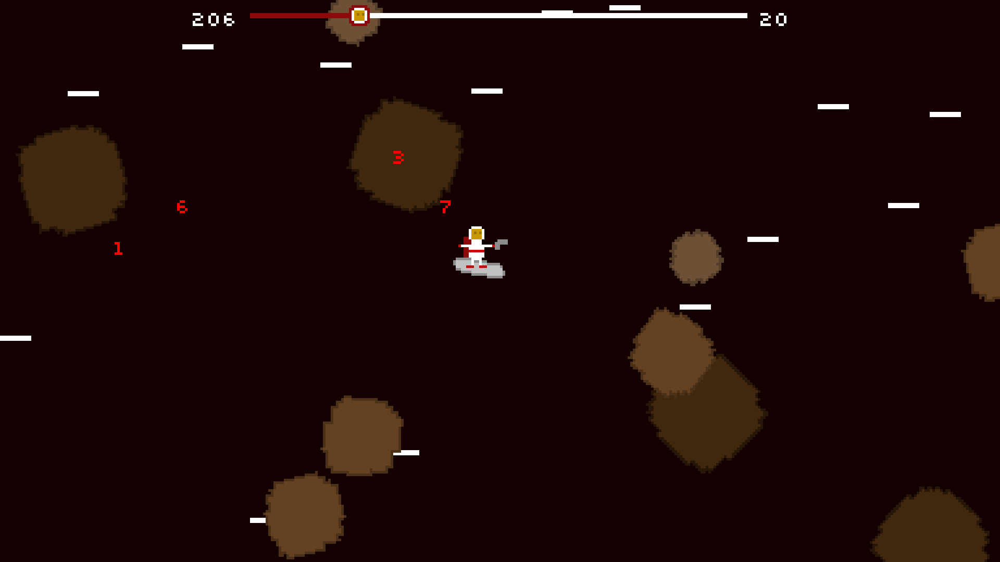

# SpaceSurf

A 2D side-scrolling space game. 

## Features

Shoot asteroids as you try to survive in space! Can you outlast the progress
bar?

## Dependencies

SpaceSurf needs the following libraries and packages.
* libsdl2
* libsdl2-image
* libsdl2-ttf
* meson
* ninja-build

## Installation

After all dependencies are installed successfully, run the following commands.
``` bash
meson build
ninja -C make
build/surf
```

## Screenshots


